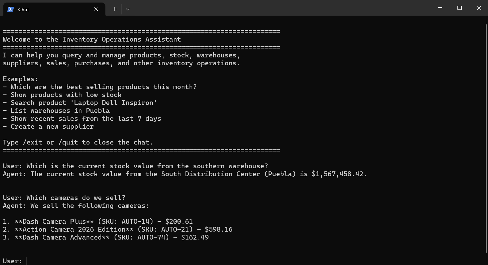
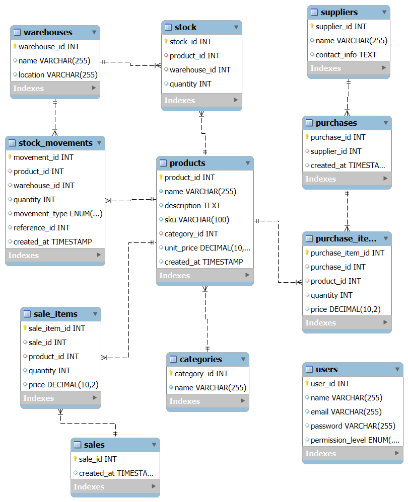

# Langchain chatbot for an inventory system


In this project I implement a local LLM-based chatbot with Langchain which is designed to assist on analyzing warehouses, suppliers, sales, purchases, stock movements, etc. of an inventory system from a ficticius reseller company.

The system is composed by a MySQL database and a Python REST API which is used by the AI-agent tool interface to gather the necessary data and execute specific operations.



## Overview
- Inventory system + CLI chatbot
- FastAPI + Redis backend + MySQL database
- ~60 AI tools + dynamic tool subset selection based on user query
- Locally runs Ollama qwen3.5:9b LLM

## Project structure

```
project/
├── api/
│   ├── db/
│   │   ├── config.json
│   │   └── interface.py
│   └── routes/
│       ├── operations.py
│       ├── queries.py
│       └── sessions.py
├── chatbot/
│   ├── config.py
│   ├── interface.py
│   ├── model.py
│   ├── session.py
│   └── tools.py
├── config/
│   └── config.py
├── core/
│   └── client.py
├── db/
│   ├── config.json
│   ├── init.py
│   ├── procedures.sql
│   └── schema.sql
├── generation/
│   ├── config.py
│   ├── generator.py
│   └── supplier_price_matrix.csv
├── assets/
│   └── ...
├── app.py
├── chat.py
└── main.py
```

## Inventory database

The MySQL database is designed for an inventory and sales management system. It stores product categories, products, warehouses, and stock levels. Products belong to categories, can be stored in multiple warehouses, and their available quantities are tracked in the stock table. The stock_movements table records every inventory change, such as incoming stock from purchases, outgoing stock from sales, or transfers between warehouses, making it possible to audit inventory history and understand how stock levels change over time.

The system also supports suppliers, purchases, sales, and user authentication. Suppliers can provide products through purchases, where each purchase can contain multiple products stored in purchase_items. Similarly, sales are stored in the sales and sale_items tables, allowing multiple products to be sold in a single transaction. Finally, the users table manages login information and permission levels, distinguishing between administrators and regular users. There are 60+ stored procedures implemented to solve analytical queries or execute CRUD operations.



## Backend
The backend is composed by a Python REST API implemented with FastAPI and a session-manager with hashing + TTL for session tokens is implemented with Redis.

The process to create a client session starts with a login request at ```http://localhost:8000/login``` with the user's ``username`` and ``password`` credentials. The API runs a MySQL stored procedure to look-up into the database for a user with such username, if it exists the real hashed password is returned. Then, the introduced password is validated using the ``passlib.CryptContext.verify`` method. If the validation is correct, the Redis database generates a new session-token and a hashed version of it, so that a new session is creted with the hashed token and the corresponding user ID with a specific TTL. Finally, the session token is retruned into the client cookies and a 200 response.

Each one of the MySQL stored procedures has an implementation in the API and requires a valid session token to be executed. Such verification is done at te begining of each API endpoint. The client stores the token in its cookies, so it is easy to manage such process behind the scenes.

## Chatbot
The chatbot is an inventory operations assistant built on top of LangChain and Ollama using the Qwen model. Its main purpose is to answer operational questions and execute actions related to inventory, products, sales, suppliers, warehouses, forecasting, categories, and users. Instead of exposing all tools to the model at once, it dynamically selects only the relevant tool groups for each query by matching keywords in the user message. For example, if the user asks about sales, revenue, or best-selling products, only sales-related tools are enabled; if they ask about warehouses or stock transfers, warehouse tools are included. This reduces model confusion, lowers prompt size, and improves tool selection accuracy.

The chatbot also uses role-based access control. Users with the `admin` role can access every tool group, including user creation and management, while `end_user` accounts are restricted from administrative tools. To improve performance, agents are cached based on the combination of enabled tools and user role, avoiding unnecessary recreation of the same agent configuration. The system prompt is generated dynamically for each tool set and includes operational rules such as never inventing IDs, using tools whenever possible, interpreting date ranges consistently, and keeping answers concise. The chat loop maintains conversation history, streams responses in real time, and keeps the model loaded in memory for faster future requests.


## Execution
To run all the project and start a chat, simply run
```bash
python3 main.py
```
There are several commands ``cmd`` implemented for a controlled execution
- config: Create configuration files from the main [config.py](config/config.py) file.
- init: Initalize the database (reset if already executed), it requires MySQL80 service running.
- api: Start the API server.
- populate: Populate the database via API calls (users, warehouses, products, purchases, sales, etc.) and create the [supplier_price_matrix.csv](generation/supplier_price_matrix.csv) file.
- chat: Run an Ollama LLM instance locally and start a new chat.
- (default): Execute the last processes in this order.

```bash
python3 main.py cmd
```
You may also start the API server by executing

```bash
fastapi run app.py
```
Or start Ollama and open a new chat with

```bash
python3 chat.py
```